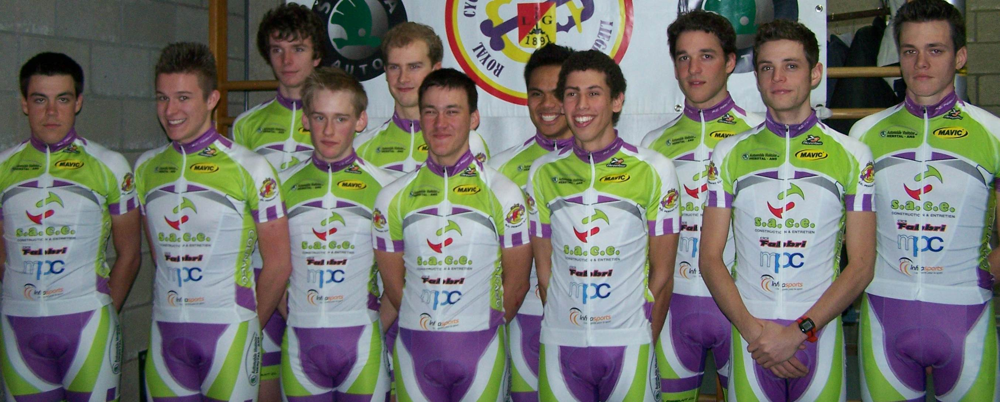

# Guillaume Rase 

 
Mon nom est Guillaume RASE, j'ai 23 ans, je possède un diplôme d'éducateur spécialisé, mais surtout mon rêve est de devenir COUREUR CYCLISTE PROFESSIONNEL.

J'aborde la saison 2014 avec la rage de vaincre après une saison 2013 très noire marquée tout d'abord par des problèmes de genou en janvier et ensuite par 3 chutes dont la dernière en juillet qui m'a valu une opération de la clavicule qui était cassée à quatre endroits avec l'os qui perçait la peau.

Cette saison se passera sous les couleurs du Pesant Club liègeois qui m'a accorder sa confiance et j'ai bien l'intention d'en être digne.
Je peux d'ailleurs toujours compter sur le soutien de mon entraîneur Charly BERARD, ancien professionnel rempli d'expériences, et de Geneviève DANIS mon mentor qui tous deux m'aident à réaliser mon rêve. Merci à tous les deux.
